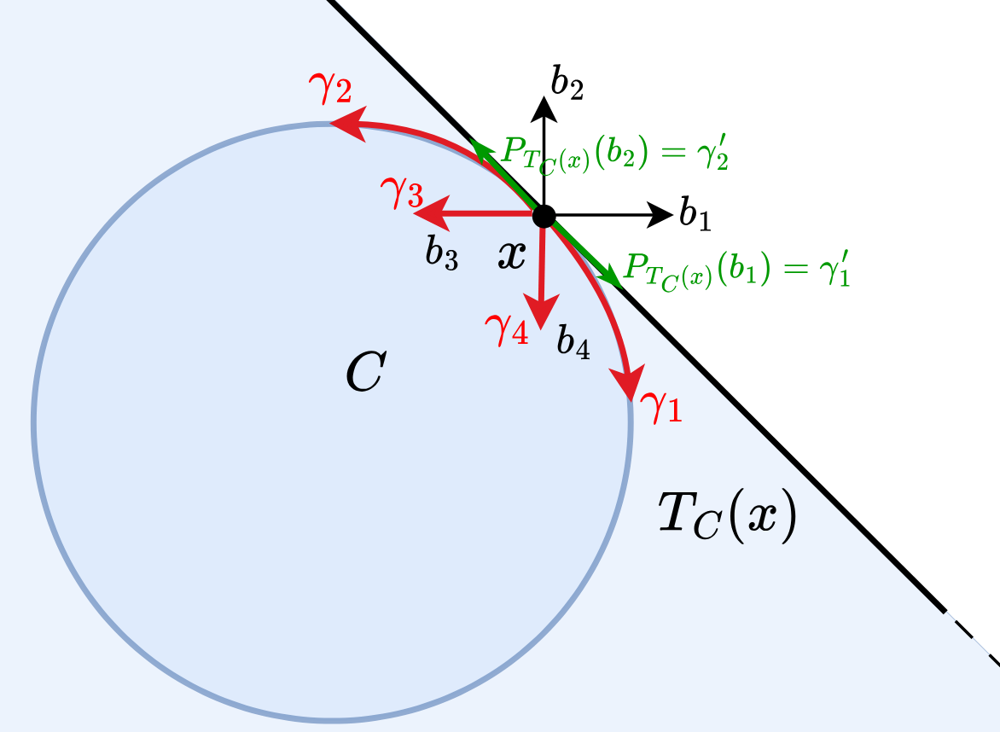

[](https://www.python.org/downloads/release/python-3130/)
[](https://opensource.org/license/gpl-3-0)

<p>
  
</p>

## Projection-based curve pattern search for black-box optimization over smooth convex sets

Implementation of the FSP framework proposed in 

[Jia, X., Lapucci, M. & Mansueto, P., Projection-based curve pattern search for black-box optimization over smooth convex sets. arXiv pre-print (2025)]

If you have used our code for research purposes, please cite the publication mentioned above.
For the sake of simplicity, we provide the Bibtex format:

```
TODO
```

### Main Dependencies Installation

In order to execute the code, you need an [Anaconda](https://www.anaconda.com/) environment with Python>=3.13.

For the packages installation, open a terminal (Anaconda Prompt for Windows users) in the project root folder and execute the following commands.

```
pip install numpy
pip install tqdm
pip install pandas
pip install cvxopt
```

### Usage

Given a terminal (Anaconda Prompt for Windows users), you can run the code using the command ``` python main.py```.

### Contact

If you have any question, feel free to contact us:

[Pierluigi Mansueto](https://webgol.dinfo.unifi.it/pierluigi-mansueto/)<br>
Global Optimization Laboratory ([GOL](https://webgol.dinfo.unifi.it/))<br>
University of Florence<br>
Email: pierluigi dot mansueto at unifi dot it
